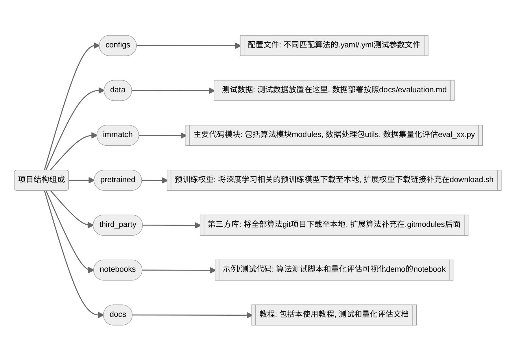
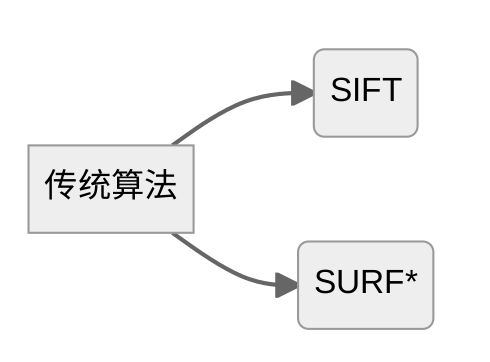
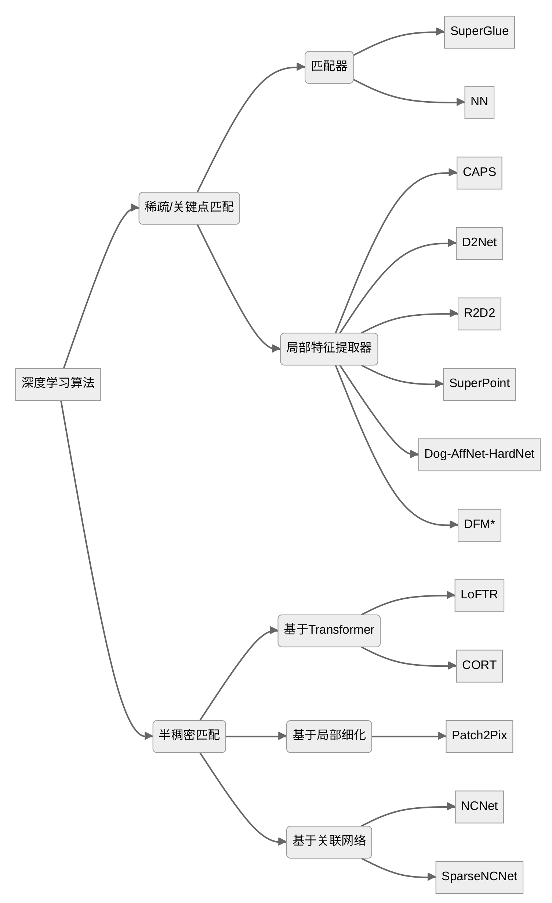

# 匹配代码库使用手册
 **使用手册维护：**
 田瑶琳、雒勖博

 **开发时间：**
 2023年3月~4月

 **使用说明：**
匹配代码库基于[image-matching-toolbox](https://github.com/GrumpyZhou/image-matching-toolbox) 进行开发和二次扩展，用于911内部学习使用和算法部署

## 1. 算法库组成
**1.1 项目组成**

 

 **1.2 算法组成**
 1. 传统算法：

 

 2. 深度学习算法：

 

> 其中，带有*标的为二次开发添加的方法（截止到完成时期，有时间需要继续更新）

## 2. 算法库使用
具体使用详见[matching-toolbox-manual.pdf](./matching-toolbox-manual.pdf)或者[matching-toolbox-manual.md](./docs/matching-toolbox-manual.md) 
