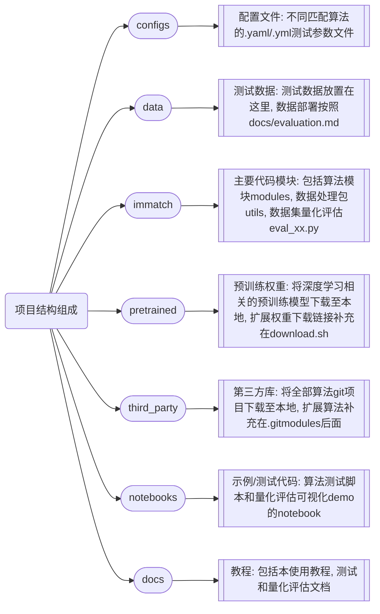
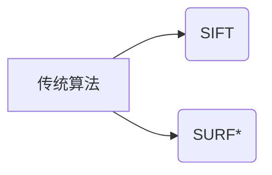
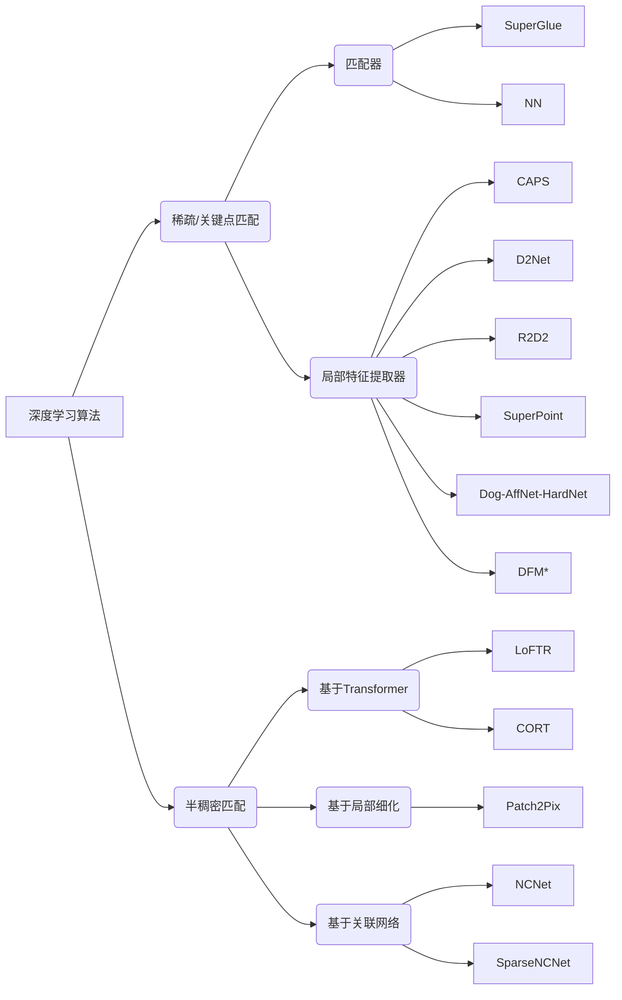

# 匹配代码库使用手册
 **使用手册维护：**
 田瑶琳、雒勖博

 **开发时间：**
 2023年3月~4月
 
  **使用说明：**
匹配代码库基于[image-matching-toolbox](https://github.com/GrumpyZhou/image-matching-toolbox) 进行开发和二次扩展，用于911内部学习使用和算法部署

## 1. 算法库组成
**1.1 项目组成**

 **1.2 算法组成**
 1. [x] 传统算法：

 2. [x] 深度学习算法：

> 其中，带有*标的为二次开发添加的方法（截止到完成时期，有时间需要继续更新）

## 2. 环境配置和部署
 **2.1 部署平台**
 1. Ubuntu $=$ 20.04
 2. Python $\geq$ 3.7
 3. Pytorch $\geq$ 1.7.0
 4. CUDA及其toolkit根据显卡驱动进行选择

**2.2 部署步骤**
**2.2.1 下载项目和算法子模块**

    ## 从gitee直接加载(TODO：完善代码并提交到gitee)
    git clone https://gitee.com/XXX/image-matching-toolbox.git
    cd image-matching-toolbox/
    git submodule update --init

**2.2.2 预训练模型加载**

    # 除了DFM的预训练模型是直接从torchvision加载的，其他的都是下载的pth权重文件
    cd pretrained/
    bash download.sh
    
**2.2.3 虚拟环境配置和安装**
	Ⅰ. 创建虚拟环境
	
    # RTX_4090
    conda env create -f environment.yml
    # other hardware
    conda env create -n immatch python=3.7
    conda activate immatch
   Ⅱ. 安装代码库及其依赖

    # 下载immatch toolbox(作为python package)
    # 注意: 下载同时支持surf和sift的opencv版本及其对应opencv-contrib的版本
    cd image-matching-toolbox/
    python setup.py develop
  Ⅲ. 代码库的卸载 (optional)
 
    # 卸载immatch toolbox(作为python package)
    pip uninstall immatch
  Ⅳ. 安装pycolmap (optional)
 
    # 如果需要用到定位的量化评估
    pip install git+https://github.com/mihaidusmanu/pycolmap
    # 或者直接
    pip install pycolmap
   Ⅴ. 更新immatch (optional)
    
    # option1: 直接修改setup.py并重新更新匹配代码库
    cd image-matching-toolbox/
    python setup.py develop
    # option2: 修改environment.yml
	conda activate immatch
	conda env update --file environment.yml --prune

## 3.  项目测试和可视化
 **3.1 数据准备**
>理论上项目可以支持evaluation里面提及的全部公开数据集，但仅完成Hpatches数据集类型的测试脚本撰写以及测试。因此数据格式严格按照Hpatches进行整理，其中真值的获取可以根据data/matlab_gt文件夹下的代码实现手动标注

**3.1.1 目录结构**
 * 匹配图像与待匹配图像放在一个文件夹下，数据集结构如下：
```
├─v_1
│      1.JPG
│      2.JPG
|      attribs.txt
│      H_1_2.txt
│      
├─v_2
│      1.JPG
│      2.JPG
|      attribs.txt
│      H_1_2.txt     
...
│      
└─v_9
        1.JPG
        2.JPG
        attribs.txt
        H_1_2.txt
        ...
│      
...
```
其中，
* v_1, v_2, ..., v_9为每组测试数据的名字，每组包含两张图片
* *attribs.txt*用来描述这组图像是用于什么任务的，如 'time' (viewpoint) 和 'light' (illumination) ，不强制有，只有验证光照角度和强度时才要区分。
* *H_i_j.txt*是使用matlab标定产生的从图像 *i* 到图像 *j* 的单应矩阵真值

**3.1.2 Matlab手工标定**
* 打开同目录下的*labelingTools4Matching.m*，将*imgDirPath*改为要标定的数据集的根目录
* 运行脚本，一组图像会陆续弹出若干个窗口，只需要在*Control Point Selection Tool*窗口内标点即可，一对图像最好标*10*对以上的匹配点（最少*4*对）
* 标定完成后，会在每组图像目录下生成如**3.1.1**所示的H_x_x.txt真值文件

 **3.2 输入输出格式**
**3.2.1 输入格式规范**
 - 输入一组测试图像
	 - 使用方法：修改并运行 text_single.sh, 指定调用test_1-pair.py并指定配置参数
	 - 数据格式：存储图像所在的路径的csv文件、对应的原始图像 (目前可以是ppm、jpg、png)、调度接口json文件 (待开发)
 - 输入多组测试图像
	- 使用方法：修改并运行 text_multi.sh, 指定调用test_multi-pair.py并指定配置参数
	- 数据格式：存储图像所在的路径的csv文件及其对应的原始图像 (目前可以是ppm、jpg、png) 所在的压缩包、调度接口json文件 (待开发)

**3.2.2 输出格式规范**
 - 给定真值
	 - 输出内容：得到匹配点对总数、对应关系和测试用时，如需可以将点对匹配图像存储至本地
 - 未给定真值
	 - 输出内容： 在没有给定真值的情况下可以输出匹配点对关系和数目 (以npy格式存储在项目的output)，统计运行时间，便于后续可视化；也可以考虑直接输出并本地化npy文件，离线解析数据

**3.3 量化评估 (以Hpatches为例)**
**3.3.1 量化评估指标**
 - 指标1：平均精度MMA
> MMA: 计算模型输出的匹配点的MMA (mean matching accuracy)，具体而言计算的是匹配点对在单应变换后，欧式距离（度量）低于某个阈值的百分比
 - 指标2：单应矩阵估计HE
>Homography Estimation: 其实就是把计算匹配点的 MMA 变成了计算4个角点的 MMA，然后计算像素误差

**3.3.2 量化评估方法和示例**
 - 方式1：以log日志记录量化结果
   ``` 
    # 输入示例：关键的参数参考eval_hpatches.py
    python -m immatch.eval_hpatches --config  'superpoint' 'ncnet' \
		    --task 'both' --save_npy --root_dir .  
	```
	```    
    # 输出示例：输出的MMA结果结构如下
    >>>>以SuperPoint的结果为例，输出日志如下：
    >>>>Eval hpatches: task=matching+homography method=SuperPoint_r4 scale_H=False 
    rthres=2 thres=[1, 3, 5, 10] 
    >>Finished, pairs=540 match_failed=0 matches=1082.2 match_time=0.03s
    ==== Image Matching ====
    Save results to ./outputs/hpatches/cache/SuperPoint_r4.npy
    #Features: mean=2003 min=212 max=7815
    #(Old)Matches: a=1082, i=819, v=1327
    #Matches: a=1082, i=819, v=1327
    MMA@[ 1  3  5 10] px:
    a=[0.33 0.65 0.74 0.79]   # average MMA in both tasks
    i=[0.42 0.68 0.78 0.83]   # illumination testing results
    v=[0.25 0.61 0.7  0.75]   # viewpoint testing results
    ==== Homography Estimation ====
    Hest solver=degensac est_failed=0 ransac_thres=2 inlier_rate=0.65
    Hest Correct: 
    a=[0.51 0.83 0.89 0.94]
    i=[0.65 0.95 0.99 1.  ]
    v=[0.38 0.72 0.8  0.89]
    Hest AUC: 
    a=[0.27 0.56 0.69 0.81]
    i=[0.36 0.69 0.81 0.9 ]
    v=[0.18 0.44 0.58 0.72]
 - 方式2：绘制MMA对比曲线（侧重于科研使用）
  

**3.4 可视化效果**
 - 单张测试：
 > TODO：完善测试脚本text_single.sh和test_1-pair.py并测试
 - 多张测试：
 >TODO：完善测试脚本text_multi.sh和test_multi-pair.py并测试
 
## 4.  项目扩展和未开发模块
 **4.1 如何扩展新算法？**
- 第一步：完善并修改项目的setup环境依赖 (如果新算法的引入会造成包冲突，则需要用docker隔离环境)
- 第二步：在.gitsubmodules中增加第三方算法项目，并在download.sh中增加预训练模型下载路径
- 第三步：在config文件夹下添加新算法的yaml，并在immatch中增加对应子模块调用代码 (模块化接口)
- 第四步：测试算法并完善代码库

 **4.2 如何跨平台部署本代码库？**
 - 思路：项目环境预计采用docker部署和迁移、主要利用ROS或protobuf+redis的方式进行通信调度，接口类型由调度系统决定，待接口确定再最终需要撰写相关内容进入使用文档 (即，测试输入输出流)
 - 接口代码开发：在目前的基础上还可以补充以下内容
	 - csv存储的图像路径列表的读取和解析
	 - 压缩包的解析和格式检查
	 - 修改可视化代码并增加调用接口
	 - 将测试得到的npy格式的数据进行离线解析

